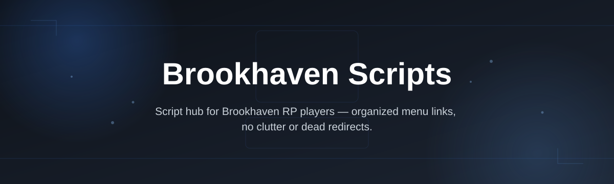
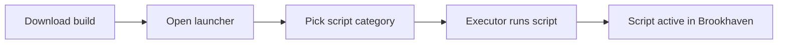

# brookhaven-script-hub

*A no-nonsense way for Brookhaven players to run scripts without babysitting a toolchain.*

> **TL;DR**
> - This is a Windows-only hub for Brookhaven scripts — no build tools, no fuss.
> - You get one download, one executable, and a UI that doesn't pretend to be a spreadsheet.
> - If you've been burned by dead links and fake "updated 2025" repos, this page is the antidote.

## What this is

**brookhaven-script-hub** is a collection point for Brookhaven-focused scripts, packaged into a single downloadable build instead of forty scattered pastebin links. If you play Brookhaven and you're tired of copy-pasting raw script text into sketchy executors that half-work, this repo exists to fix that specific annoyance — nothing more, nothing less.

The project isn't trying to be a general-purpose scripting platform. It's built around one game, one workflow, and one goal: get you from "I heard there's a script for that" to "it's running" in under two minutes. The scripts here are maintained with Brookhaven's actual update cycle in mind, which — if you've used this game long enough — you know breaks things constantly.

  

That button takes you to the project's landing page, where the current build lives for download.

## Who it is for

- **Brookhaven regulars** who want quality-of-life scripts without digging through Discord archives.
- **Players on shared or family PCs** who need something that doesn't need admin-level installs.
- **People who tried three other "script hubs" this month** and got tired of pop-up walls.
- **Roleplay server hosts** looking for consistent tooling to recommend to their community.
- **Anyone new to Brookhaven scripting** who just wants a straight answer, not a Discord invite gate.

## What you can do

- **Run Brookhaven scripts from a single launcher** instead of managing loose files.
- **Update to newer script versions** without re-downloading the whole hub each time.
- **Browse categorized scripts** grouped by what they actually do in-game.
- **Skip the copy-paste workflow** most other "hubs" still force on you.
- **Keep a lightweight footprint** — the build is standalone, not a background service.
- **Use it offline after download** once the initial fetch from the landing page is done.
- **Avoid re-entering settings** between sessions thanks to saved local preferences.
- **Report broken scripts fast** through the landing page's feedback link.

## Getting started

1. Open the landing page using the download button above.
2. Grab the latest build listed there — it's versioned, so you know what you're getting.
3. Run the downloaded file on Windows 10 or 11.
4. Pick a script category from the launcher UI.
5. Join your Brookhaven server and execute.

<strong>Requirements</strong>

| Requirement | Detail |
|---|---|
| OS | Windows 10 or Windows 11 (64-bit) |
| Install | None — standalone executable, no setup wizard |
| Toolchain | Not needed — no build steps, no dependencies to install |
| Game | Brookhaven (Roblox), any active server |
| Storage | Under 100 MB free space |

If your antivirus flags an unsigned `.exe`, that's expected for small independent tools — see Troubleshooting below before assuming the worst.

<strong>How it works</strong>

The launcher is intentionally simple: it doesn't reinvent script injection, it just organizes it.

1. You download the build from the landing page.
2. The launcher opens and reads its local script index.
3. You select a script category relevant to what you want in Brookhaven.
4. The launcher hands the script off to your existing executor.
5. Brookhaven runs it like any other script — the hub is the organizer, not a replacement for your executor.

## FAQ

**Is brookhaven-script-hub the same as a Roblox exploit tool?**
No. It's a script organizer/launcher for Brookhaven. It doesn't replace or include an executor — you still need one for the scripts to actually run in-game.

**Do Brookhaven scripts stop working after game updates?**
Sometimes, yes. Brookhaven ships frequent updates, and scripts relying on specific game objects can break until they're patched. Check the landing page for build notes when something stops working.

**Can I use this on Mac or mobile?**
Not currently. The build targets Windows 10/11 only — there's no macOS or mobile version planned right now.

**Why isn't this hosted directly in the repo as a release?**
The landing page handles versioning and distribution more reliably than GitHub Releases for this kind of project, so that's where the current build always lives.

**Are these scripts safe for my Roblox account?**
Any third-party script carries inherent risk with Roblox's terms of service. Use an alt account if you're cautious, and don't run scripts you haven't reviewed on accounts you can't afford to lose.

## Troubleshooting

- **Launcher won't open** — confirm you're on Windows 10/11 64-bit and that the download finished completely (check file size against the landing page listing).
- **Antivirus deletes or quarantines the file** — this happens with unsigned executables from small projects; whitelist the file only if you trust the source, or verify the download hash on the landing page.
- **Script list is empty on first launch** — restart the launcher once; the local index sometimes needs a second pass to populate.
- **Selected script does nothing in-game** — make sure your executor is actually running and attached before selecting a script in the hub.

## License

Released under the [MIT License](LICENSE). Use it, modify it, redistribute it — just don't expect a warranty. This project is provided as-is, with no guarantee it'll survive Brookhaven's next big update, because nothing ever fully does.

  

